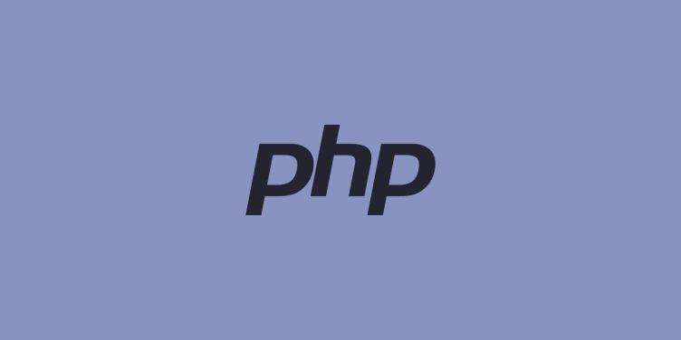

# Cartas de um terráqueo ao planeta Php, Capitulo 1: Quem é Você?

O Php é uma linguagem de programação, poderosa e que roda no servidor web. No inicio de tudo o seu criador não tinha
o objetivo de criar uma linguagem de programação, mas sim, de criar scripts que o ajudasse em seu projeto pessoal. 
Com o sucesso da ferramenta em pouco tempo Rasmus Lerdorf disponibilizou o código para a comunidade, o que chamou 
a atenção de muita gente inclusive daqueles que daria muito mais poder ao Php: Andi Gutmans e Zeev Suraski.

Agora você conhece um pouco da história do php, mais informações pode encontrar nesse vídeo: [Site do PHP](https://php.net)

E mesmo em 2023 Php é uma linguagem atual e poderosa, para o backend de aplicações, possui vários frameworks 
e bibliotecas incríveis, e Php moderno NÂO é uma misturéba de código, como chegou a ser comparado há algumas semanas; 
hoje em dia o php é maduro e pderoso o suficiente para criação de aplicações de código limpo, legível e escalável.

Espero que tenha gostado do artigo, nos vemos na próxima carta.
Abraços.
