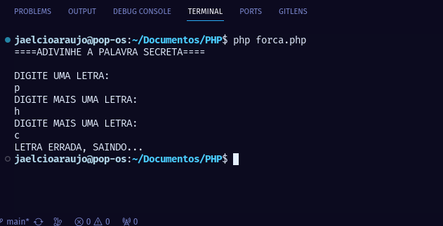

# Cartas de um terráqueo ao planeta Php, Capitulo 12: Exercício

Olá pessoal, tudo bem!? Espero que sim!
Hoje vamos fazer um exercício que criei para vocês, ele consiste praticamente em abordar todos os conceitos aprendidos até agora; ele é "joguinho" onde você precisa digitar as letras corretas da palavra para poder vencer, é simples mas iremos comparar letra a letra, usando arrays, condicionais, funções etc...
Este "joguinho" só funciona no terminal, mas você pode implementar HTML para rodar no navegador.
Segue o código:

~~~php
<?php

// Título.
  $titulo = "====ADIVINHE A PALAVRA SECRETA====\n";

// Imprimir o título.
  echo "$titulo\n";

// Definindo a palavra.
function definePalvra(){
  return array('P', 'H', 'P');
}
 
// Mostra mensagem.
function exibeMensagem() {
  echo "DIGITE UMA LETRA: \n";
}

// Captura digitação.
function capturaDigitacao() {
  $entrada = fgets(STDIN);
  $entrada = trim($entrada);
  return strtoupper($entrada);
}

// Guarda letras digitadas num array.
function guardaLetras() {
  $letras = [];
  $entradaTeclado = capturaDigitacao();

  for ($i = 0; $i < strlen($entradaTeclado); $i++) {
      $letras[$i] = $entradaTeclado[$i];
  }
      return  $letras;
}

// Comparar a Digitação.
function comparacaoDeArrays() 
{
  $letra = definePalvra();

  for ($i = 0; $i < count($letra); $i++) {

    $recebeDidigitados[$i] = capturaDigitacao();

    if ($letra[$i] == $recebeDidigitados[$i] and count($letra) > count($recebeDidigitados)) {
        echo "DIGITE MAIS UMA LETRA: \n";
    }

    if ($letra[$i] == $recebeDidigitados[$i] and count($letra) == count($recebeDidigitados)) {
        echo "VOCÊ ACERTOU A PALVRA PARABENS!\n";
    }

    if ($letra[$i] != $recebeDidigitados[$i]) {
      echo "LETRA ERRADA, SAINDO... \n";
      exit();
    }

  }

  }

// Inicia o Jogo
exibeMensagem();
comparacaoDeArrays();
~~~

Veja como fica no seu terminal quando executado:

Caso erre alguma letra em qualquer posição do array ele sairá do "joguinho":

Tente melhorar o código, refatorar etc...
Guarde bem este código com você, ele é um exercício, e vai te preparar para nosso novo projeto que já está chegando!
Até a próxima !
