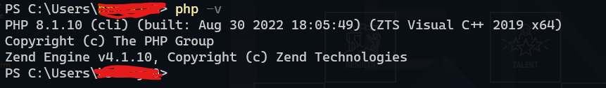

# Cartas de um terráqueo ao planeta Php, Capitulo 2

Olá pessoal, tudo bem!? Espero que sim!
Em nossa segunda carta, vamos falar sobre como se inicia em Php, e de fato do precisamos para "manter contato com ele".
O Php é uma linguagem de programação muito leve e rápida; para você começar a trabalhar com ela não precisa de quase nada, 
nem mesmo um computador muito potente, também não precisa baixar milhares de outros programas e nem pacotes para começar a 
criar seus projetos; vamos ver do que precisamos à seguir:

1 - Baixe a ultima versão do Php para Windows aqui: [PHP 8.2](https://windows.php.net/downloads/releases/php-8.2.8-nts-Win32-vs16-x64.zip)
2 - Para Linux você pode baixar aqui: [PHP 8.2](https://www.php.net/distributions/php-8.2.8.tar.gz)

Dai não precisa de mais nada, ao contrário do que muitos pensam o Php não precisa de mais nada para rodar seus scripts. 
Descompacte os arquivos em local de sua preferencia. Para ficar mais fácil vamos, no caso do Windows adicionar o php às 
variáveis de ambiente, e para isso eu ja criei um artigo que você pode acessar aqui: [Artigo](https://pt.linkedin.com/pulse/php-sem-o-apache-jaelcio-araujo?trk=portfolio_article-card_title). 
Isso vai permitir que o Php seja reconhecido em todo o nosso sistema e dessa maneira possamos 
chamar o comando php em qualquer lugar do nosso sistema. Assim:

