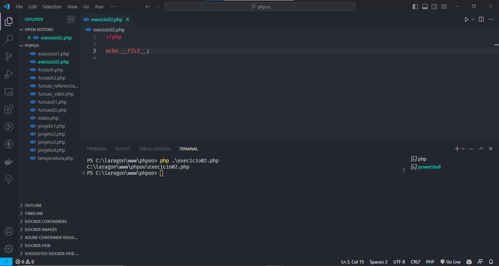

# Cartas de um terráqueo ao planeta Php, Capitulo 4: Variáveis #2.

Olá pessoal, tudo bem!? Espero que sim!
Antes de qualquer coisa vamos aprender algo que faltou na carta anterior. Na carta anterior falamos sobre variáveis, mas não abordamos as "constantes", então hoje vamos falar de constantes.
As constantes são um valor definido em nosso script que não pode ser alterado, são diferentes de variáveis. Para iniciar uma constante podemos usar o comando const ou a função define():

~~~php
const PI = 3.14159
echo PI; // 3.14159

define('PI', 3.14159);
echo PI; // 3.14159;
~~~

Todas as vezes que quisermos definir um valor que não pode ser alterado durante a execução do nosso código usamos uma constante.

## Constantes Mágicas
Existem outros tipos de constantes que são chamadas de constantes magicas, elas são usadas principalmente para obter informações sobre o 
ambiente onde o script esta sendo executado. Abaixo você pode ver uma lista com algumas constantes:

- __FILE__: O caminho do arquivo atual.
- __LINE__: O número da linha atual no script.
- __DIR__: O diretório do arquivo atual.
- __CLASS__: O nome da classe atual.
- __FUNCTION__: O nome da função atual.
- __METHOD__: O nome do método atual.
- __NAMESPACE__: O namespace atual.

As constantes mágicas podem ser acessadas usando o operador de ponto (.). 
Por exemplo, o seguinte código imprime o caminho do arquivo atual:

~~~php
echo __FILE__;
~~~

Veja o resultado no terminal:

O uso dessas constantes é muito importante dependendo do cenário que você estiver.
Espero que isso ajude, até a próxima!
