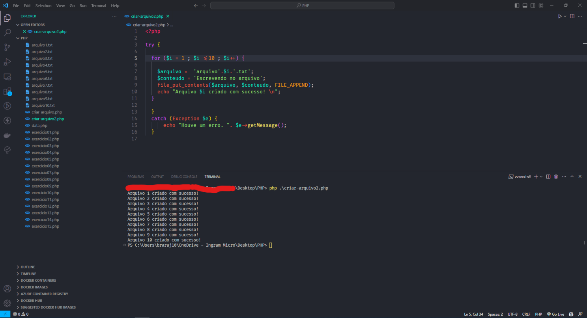

# Cartas de um terráqueo ao planeta Php, Capitulo 7: Exercício com Função.

Olá pessoal, tudo bem!? Espero que sim!
Continuando o nosso estudo sobre funções, hoje vamos realizar um exercício que eu criei usando um das dezenas de funções do próprio PHP; 
como nós estudamos, as funções são formas de executar um bloco de código e realizar ações de forma mais organizada.
Neste exemplo que criei vamos a função file_put_contents que pode ser usada para criar arquivos e ao mesmo tempo escrever nestes arquivos.
Abaixo está o código:

~~~php
<?php

try {
  for ($i = 1 ; $i <=10 ; $i++) {

    $arquivo =  'arquivo'.$i.'.txt';
    $conteudo = 'Escrevendo no arquivo';
    file_put_contents($arquivo, $conteudo, FILE_APPEND);
    echo "Arquivo $i criado com sucesso! \n";

  }

  } 
  catch (Exception $e) {
      echo "Houve um erro. ". $e->getMessage();
  }
~~~

1. **try / catch**: Essa é uma construção utilizada para lidar com exceções (erros) que podem ocorrer durante a execução do código. O código dentro do bloco try é onde as ações são realizadas, e se ocorrer algum erro, o código dentro do bloco catch é executado para tratar a exceção.
2. for loop: O código começa com um loop for que itera de 1 a 10.
3. **$arquivo = 'arquivo'.$i.'.txt';**: Essa linha cria o nome do arquivo com base no valor atual de $i. Para $i igual a 1, o nome do arquivo será "arquivo1.txt", e assim por diante.
4. **$conteudo = 'Escrevendo no arquivo';**: Aqui, uma string chamada "Escrevendo no arquivo" é definida como o conteúdo a ser escrito no arquivo.
5. **file_put_contents($arquivo, $conteudo, FILE_APPEND);**: Essa função é usada para escrever o conteúdo no arquivo. O primeiro argumento é o nome do arquivo, o segundo é o conteúdo a ser escrito e o terceiro argumento, `FILE_APPEND`, indica que o conteúdo deve ser adicionado ao final do arquivo em vez de substituir o conteúdo existente.
6. **echo "Arquivo $i criado com sucesso! \n";**: Após escrever o conteúdo no arquivo, essa linha imprime uma mensagem indicando que o arquivo foi criado com sucesso, juntamente com o número do arquivo **(`$i`)**.
7. **catch (Exception $e)**: Se ocorrer um erro durante a execução do bloco try, esse bloco catch capturará a exceção. **`Exception`** é uma classe base para exceções em PHP.
8. **echo "Houve um erro. ". $e->getMessage();**: Se ocorrer um erro, esta linha imprimirá uma mensagem de erro, seguida pela mensagem de erro específica obtida através do método getMessage() da exceção capturada.
Em resumo, este código cria 10 arquivos com nomes sequenciais **("arquivo1.txt", "arquivo2.txt", etc.)** e escreve a string "Escrevendo no arquivo" em cada um deles, adicionando o conteúdo ao final do arquivo. Se ocorrer algum erro durante o processo, uma mensagem de erro será exibida.
Vejo a saída no termina logo abaixo:

Melhore o código, crie outros, enfim aproveite e dê uma olhada na documentação do php, neste site: https://www.phptutorial.net
Até a próxima!
